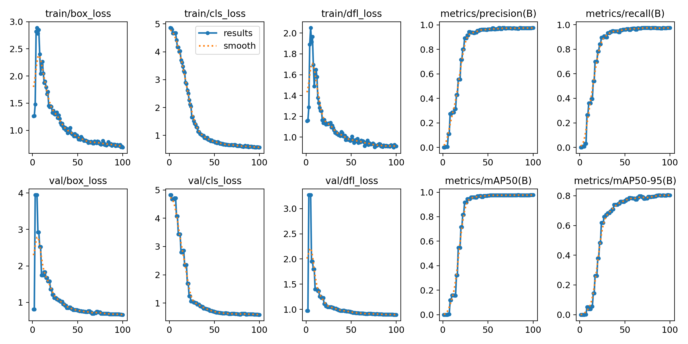

# Parking Management with YOLO

A parking monitoring system using YOLO for car detection, FastAPI/PostgreSQL for the backend, and React/TypeScript for the frontend.
The detector locates cars; polygon-based regions of interest (ROIs) determine whether parking spaces are occupied.

## 1. Project Structure

| Location | Purpose |
| --- | --- |
| `AI/datasets/` | Model, video processing, ROI configuration, and parking agent |
| `backend/` | FastAPI application, database migrations, and authentication |
| `frontend/` | React/Vite monitoring interface |
| `requirements.txt` | Local AI dependencies |

Download the [sample video from Google Drive](https://drive.google.com/drive/folders/1Oh1r7A_oLvEdj_CbBrOd79GN_CozVsHn?usp=drive_link) and save it as `AI/datasets/parking_car.mp4`.

## 2. Prepare the Dataset

Collect varied images covering different lighting, car sizes, shadows, occlusion, and empty parking spaces.
For video data, sample frames at intervals instead of using many nearly identical consecutive frames.
Annotate every visible car with a bounding box using a tool that exports **YOLO detection** labels; use one class: `0: car`.
Each image must have a matching label basename, such as `frame_001.jpg` and `frame_001.txt`.
Each label line contains `class_id x_center y_center width height`, with coordinates normalized to `[0, 1]`:

```text
0 0.500000 0.450000 0.200000 0.150000
```

Use multiple lines for multiple cars and an empty label file for an image without cars.
An example split is **70% train, 20% val, 10% test**: train updates weights, val guides model selection, and test evaluates the final model.
Split by recording session or video/time block to prevent adjacent frames from leaking between sets.
Prepare this structure, compress the top-level `datasets/` folder as `datasets.zip`, and upload it to `My Drive/Parking_mng/`:

```text
datasets/cars/
├── images/
│   ├── train/
│   ├── val/
│   └── test/
└── labels/
    ├── train/
    ├── val/
    └── test/
```

Check image/label pairing, class IDs, box coordinates, and visual alignment before training.

## 3. Train on Google Colab

Open [Google Colab](https://colab.research.google.com/) and select **Runtime → Change runtime type → GPU**.
Run the following cells in order. These are example settings, not the confirmed settings of the supplied training chart.

```python
%pip install ultralytics==8.4.126
from google.colab import drive, files
from pathlib import Path
from ultralytics import YOLO
import torch, zipfile, yaml

drive.mount("/content/drive")
assert torch.cuda.is_available(), "Enable a GPU runtime."
with zipfile.ZipFile("/content/drive/MyDrive/Parking_mng/datasets.zip") as z:
    z.extractall("/content")
config = {"path": "/content/datasets/cars", "train": "images/train",
          "val": "images/val", "test": "images/test", "names": {0: "car"}}
Path("/content/cars.yaml").write_text(yaml.safe_dump(config), encoding="utf-8")
```

Fine-tune a pretrained detector on the single car class:

```python
model = YOLO("yolov8n.pt")  # Example starting model
model.train(data="/content/cars.yaml", epochs=100, imgsz=640, batch=16,
            device=0, patience=30, seed=42, plots=True,
            project="/content/drive/MyDrive/Parking_mng/runs", name="cars")
run_dir = Path(model.trainer.save_dir)
print("Saved run:", run_dir)
```

`epochs` is the maximum number of passes over the training set; `patience` enables early stopping after no validation fitness improvement.
`imgsz` controls training resolution; larger inputs may help small cars but require more memory. Reduce `batch` to `8` or `4` if GPU memory runs out.
Outputs are saved to Drive: `weights/best.pt` is selected by validation fitness; `weights/last.pt` is the latest checkpoint.
Keep `results.csv` for exact metrics, `results.png` for curves, and `args.yaml` for the training settings.
Evaluate the selected checkpoint on held-out images, inspect predictions, and download it:

```python
best = YOLO(str(run_dir / "weights/best.pt"))
assert best.names == {0: "car"}
metrics = best.val(data="/content/cars.yaml", split="test", device=0)
print("mAP50:", metrics.box.map50, "mAP50-95:", metrics.box.map)
best.predict(source="/content/datasets/cars/images/test", conf=0.25, save=True)
files.download(str(run_dir / "weights/best.pt"))
```

Save the downloaded checkpoint locally as `AI/datasets/cars_best.pt`; back up the existing model before replacing it.
If no test split exists, omit `test` from the YAML and evaluate `split="val"`; report those as validation results.
After an interruption, reinstall dependencies, mount Drive, and restore the dataset/YAML before calling `YOLO("<actual run>/weights/last.pt").train(resume=True)`.

## 4. Training Results



The supplied chart shows approximately 100 epochs. Losses generally decrease after early spikes, while detection metrics stabilize.
`box_loss` measures localization error, `cls_loss` measures classification error, and `dfl_loss` relates to bounding box regression.
Training and validation losses follow similar downward trends, suggesting convergence on this validation data.
Visually estimated final scores are precision/recall **0.97–0.98**, mAP50 **about 0.98**, and mAP50–95 **about 0.80**.
Precision describes correct detections among predictions; recall describes detected cars among labeled cars.
mAP50 evaluates detection at IoU 0.50; mAP50–95 averages stricter IoU thresholds from 0.50 to 0.95.
These are approximate detection scores, not parking occupancy accuracy. Exact values require `results.csv`; independent testing is still necessary.

## 5. Backend and Frontend: Install and Run

Use PowerShell from the repository root. Install compatible Python (backend: 3.11+), PostgreSQL, Node.js, and pnpm; create a PostgreSQL database first.

```powershell
python -m venv .venv
.\.venv\Scripts\Activate.ps1
Set-Location backend
python -m pip install -r requirements.txt
if (-not (Test-Path .env)) { Copy-Item .env.example .env }
# Edit .env with PostgreSQL credentials and a random SECRET_KEY (32+ characters).
python -m alembic upgrade head
python -m app.seed --admin-username admin
python -m uvicorn app.main:app --reload --host 127.0.0.1 --port 8000
```

The seed command prompts for an administrator password. API docs: [localhost:8000/docs](http://localhost:8000/docs).
In another terminal, run `cd frontend`, `pnpm install --frozen-lockfile`, then `pnpm dev`.
Open [localhost:5173](http://localhost:5173) and log in with the administrator account.

## 6. Run the AI

Ensure `AI/datasets/` contains `cars_best.pt`, `parking_car.mp4`, `sorted_bounding_boxes.json`, and `slots_config.json`.
Use a single-class car model: the occupancy code processes detected boxes without filtering other classes.
From the repository root in another terminal:

```powershell
.\.venv\Scripts\Activate.ps1
python -m pip install -r requirements.txt
python -u AI/datasets/parking_agent.py --stream --no-window
```

Start the backend first. The agent uses CUDA when available, otherwise CPU; a compatible GPU driver and PyTorch build are required for CUDA.
It detects cars, checks whether box centers lie within parking polygons, and sends `OCCUPIED`/`EMPTY` updates every 3 seconds for camera ID `1`.
Watch `/monitor` in the frontend or the [local preview](http://127.0.0.1:8001/); check `/status` on port 8001 for `sync_ok`. Stop with **Ctrl+C**.
To change the model, video, camera, or backend, edit the constants in `AI/datasets/parking_agent.py`; inference currently uses `conf=0.25`, `iou=0.7`, and `IMGSZ=[1088, 1920]`.
For a different camera view, run `python slot_specification.py` from `AI/datasets/`, select parking polygons on a matching frame, save `bounding_boxes.json`, then run `python sort_slots.py`.
Inspect `sorted_preview.png`; keep the generated ROI/config JSON files together and aligned with the original video dimensions.
For standalone processing without FE/BE, run `python AI/datasets/main.py` from the root; it writes `parking_result.mp4`. Press **Q** to stop early.
If detection is slow, check CUDA and reduce inference resolution; if occupancy is wrong, check ROI alignment; if updates fail, check backend connectivity and agent logs.
